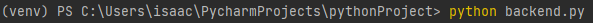

<a name="readme-top"></a>

<!-- PROJECT SHIELDS -->
[![Contributors][contributors-shield]][contributors-url]
[![Forks][forks-shield]][forks-url]
[![Stargazers][stars-shield]][stars-url]
[![Issues][issues-shield]][issues-url]
[![MIT License][license-shield]][license-url]

<!-- PROJECT LOGO -->
<br />
<div align="center">

<h2 align="center">MoodSync</h2>

  <p align="center">
    A music recommender system that aid users in searching for suitable music based on their current emotional state. 
    <br />
    <a href="https://github.com/DerrickLJH/EmotionBasedMusicRecommender"><strong>Explore the docs »</strong></a>
  </p>
</div>


<!-- TABLE OF CONTENTS -->
<details>
  <summary>Table of Contents</summary>
  <ol>
    <li>
      <a href="#project-background">Project Background</a>
    </li>
    <li>
      <a href="#project-description">Product Description</a>
      <ul>
        <li><a href="#built-with">Built With</a></li>
      </ul>
    </li>
    <li>
      <a href="#getting-started">Getting Started</a>
      <ul>
        <li><a href="#prerequisites">Prerequisites</a></li>
        <li><a href="#installation">Installation</a></li>
      </ul>
    </li>
    <li><a href="#usage">Usage</a></li>
  </ol>
</details>


<!-- Project Background -->
## Project Background

Finding the perfect song to match an individual’s mood is time-consuming and frustrating. Individuals would find themselves rounding in circles due to limited music knowledge and lack of adventurousness in exploring songs in different genres. Addressing these challenges would significantly enhance the enjoyment of music and make it easier for individuals to find songs that truly evoke and express their emotions.
<p align="right">(<a href="#readme-top">back to top</a>)</p>

<!-- Product Description -->
## Product Description
MoodSync uses OpenCV Library to allow users to record a video of their facial expression. This input will then be utilized by the ResNet50V2 Model for emotional analysis / prediction, providing the users with a curated playlist of songs that match their current emotion.
<p align="right">(<a href="#readme-top">back to top</a>)</p>


### Built With

[![Flask][Flask]][Flask-url] [![Python][Python]][Python-url] [![OpenCV][OpenCV]][OpenCV-url] [![Tensorflow][Tensorflow]][Tensorflow-url] [![MariaDB][MariaDB]][MariaDB-url] ![HTML5] ![JavaScript]


<p align="right">(<a href="#readme-top">back to top</a>)</p>


<!-- GETTING STARTED -->
## Getting Started

This is an example of how you may give instructions on setting up your project locally.
To get a local copy up and running follow these simple example steps.

### Prerequisites

This is an example of how to list things you need to use the software and how to install them.
* Install packages with pip
  ```sh
  pip install -r requirements.txt
  ```

### Installation

1. Clone the repository
   ```sh
   git clone https://github.com/DerrickLJH/EmotionBasedMusicRecommender.git
   ```
2. Install the [ResNet50v2 Model](https://drive.google.com/drive/folders/16DPcK4bTOtkt-1egVX6FDejWzvoRU_in?usp=sharing)

3. Install MariaDB at https://mariadb.org/download

4. Update the credentials for database in source code

   ![exe-screenshot1]

5. Uncomment lines 244-245 and run the backend.py file. 

   ![exe-screenshot2]

   Open a terminal or command prompt, navigate to the directory containing the backend.py file, and execute the file using the Python interpreter.

   


6. Add your own spotify developer CLIENT_ID and CLIENT_SECRET into the env file.

   !(static/api_cred.png)

7. Open a terminal or command prompt, navigate to the directory containing the main.py file, and execute the file using the Python interpreter.

   !(static/main.py_terminal.png)

   Should output as:

   !(static/main.py_output.png)


[//]: # (3. Enter your Spotify Web API in `.env`)

[//]: # (   ```js)

[//]: # (   CLIENT_ID = 'ENTER YOUR CLIENT_ID';)

[//]: # (   CLIENT_SECRET = 'ENTER YOUR CLIENT_SECRET';)

[//]: # ()
[//]: # (   ```)

<!-- USAGE EXAMPLES -->
## Usage

<div style="display:flex;">
  
  
  
</div>

<p align="right">(<a href="#readme-top">back to top</a>)</p>


<!-- MARKDOWN LINKS & IMAGES -->
<!-- https://www.markdownguide.org/basic-syntax/#reference-style-links -->
[contributors-shield]: https://img.shields.io/github/contributors/DerrickLJH/EmotionBasedMusicRecommender.svg?style=for-the-badge
[contributors-url]: https://github.com/DerrickLJH/EmotionBasedMusicRecommender/graphs/contributors
[forks-shield]: https://img.shields.io/github/forks/DerrickLJH/EmotionBasedMusicRecommender.svg?style=for-the-badge
[forks-url]: https://github.com/DerrickLJH/EmotionBasedMusicRecommender/network/members
[stars-shield]: https://img.shields.io/github/stars/DerrickLJH/EmotionBasedMusicRecommender.svg?style=for-the-badge
[stars-url]: https://github.com/DerrickLJH/EmotionBasedMusicRecommender/stargazers
[issues-shield]: https://img.shields.io/github/issues/DerrickLJH/EmotionBasedMusicRecommender.svg?style=for-the-badge
[issues-url]: https://github.com/DerrickLJH/EmotionBasedMusicRecommender/issues
[license-shield]: https://img.shields.io/github/license/DerrickLJH/EmotionBasedMusicRecommender.svg?style=for-the-badge
[license-url]: https://github.com/DerrickLJH/EmotionBasedMusicRecommender/blob/master/LICENSE.txt
[Flask]: https://img.shields.io/badge/Flask-000000?style=for-the-badge&logo=flask&logoColor=white
[Flask-url]: https://flask.palletsprojects.com/
[Python]: https://img.shields.io/badge/Python-14354C?style=for-the-badge&logo=python&logoColor=white
[Python-url]: https://www.python.org/ 
[MariaDB]: https://img.shields.io/badge/MariaDB-003545?style=for-the-badge&logo=mariadb&logoColor=white
[MariaDB-url]: https://mariadb.org/
[OpenCV]: https://img.shields.io/badge/OpenCV-5C3EE8.svg?style=for-the-badge&logo=OpenCV&logoColor=white
[OpenCV-url]: https://mariadb.org/
[Tensorflow]:https://img.shields.io/badge/TensorFlow-FF6F00?style=for-the-badge&logo=tensorflow&logoColor=white
[Tensorflow-url]: https://tensorflow.org/
[HTML5]: https://img.shields.io/badge/HTML5-E34F26?style=for-the-badge&logo=html5&logoColor=white
[JavaScript]: https://img.shields.io/badge/JavaScript-F7DF1E.svg?style=for-the-badge&logo=JavaScript&logoColor=black

[product-screenshot1]: static/homepage.png
[product-screenshot2]: static/recordingpage.png
[product-screenshot3]: static/songsrecopage.png

[exe-screenshot1]: static/mariadb_params.png
[exe-screenshot2]: static/backend.png


